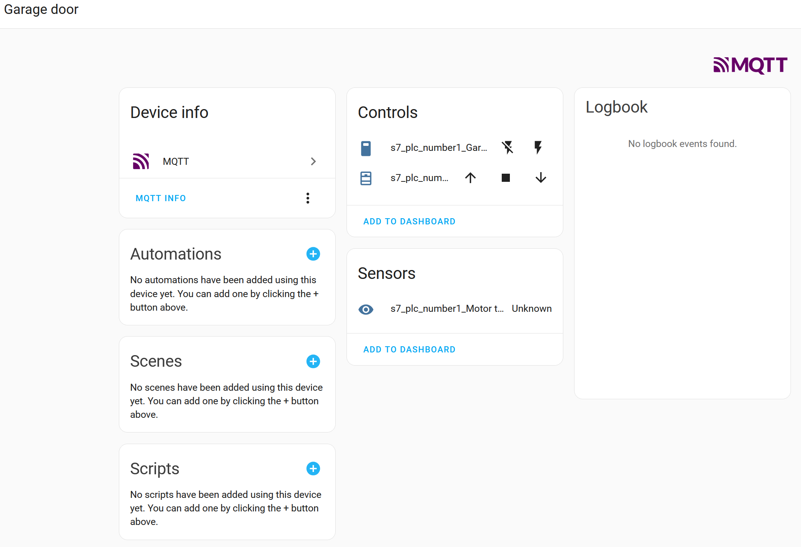

# MQTT S7 Connector - Home Assistant Addon

This project integrates [mqtt-s7connector developed by Tim Roemisch](https://github.com/timroemisch/mqtt-s7-connector) as an add-on for Home Assistant.

This documentation file is edited so it will contain everything you need to know to make it work with your Home Assistant installation and your Siemens PLC.

- [Purpose](#purpose)
- [Requirements:](#requirements)
- [How to install](#how-to-install)
- [Addon options](#addon-options)
  - [Single PLC](#single-plc)
  - [Multiple PLC's](#multiple-plcs)
- [Configuration](#configuration)
  - [Log level](#log-level)
  - [Config File](#config-file)
    - [`plc` Object](#plc-object)
    - [`mqtt` Object](#mqtt-object)
    - [`devices` Object](#devices-object)
  - [Address formatting](#address-formatting)
  - [Device types and attributes](#device-types-and-attributes)
  - [Attribute Options](#attribute-options)
    - [`rw` option](#rw-option)
    - [`update_interval` option](#update_interval-option)
    - [`unit_of_measurement` option](#unit_of_measurement-option)
    - [`set_plc` option](#set_plc-option)
    - [`write_back` option](#write_back-option)
  - [Device name](#device-name)
- [Auto Discovery](#auto-discovery)
- [License](#license)

## Purpose

This tool can receive data over mqtt and can write it to a designated address on a plc and vice versa, enabling smart home data to be displayed in the Home Assistant.

## Requirements:

- Home Assistant installation (HAOS or Supervised, other installation methods do not support addons)
- a [MQTT broker](https://github.com/home-assistant/addons/tree/master/mosquitto)
- the Home Assistant [MQTT integration](https://www.home-assistant.io/integrations/mqtt/)
- Siemens PLC (S7-300,400,1200 or 1500) with an ethernet connection. I will add support for LOGO
- Access to the PLC program/software

## How to install

- Open your Home Assistant web interface
- Go to Settings > Add-ons
- In the lower right corner click "Add-on Store"
- At the top right, click the 3 dots and "Repositories"
- Now add `https://github.com/dixi83/hassio-addons` and click "Add" followed by "Close"
- Find the "MQTT Siemens S7 Connector" in the store and click "Install"

Or add the repo by clicking:

[](https://my.home-assistant.io/redirect/supervisor_add_addon_repository/?repository_url=https%3A%2F%2Fgithub.com%2Fdixi83%2Fhassio-addons)

## Addon options

### Log level

There are several log levels if there are problems changing the level to debug could help identify the problem. If you have issues and want support, please share switch to debug and share the log information.

`warning` is the recommended log level.

### Config files

Here you can add a config file for each PLC you want to connect with. The files should be placed in the `addon_configs\xxxxxxxx_mqtt-s7-connector` folder

#### Single PLC

If you just need to connect to 1 PLC, use this configuration:

```yaml
log_level: warning
config_files:
  - config.yaml
```

#### Multiple PLC's

If you have multiple PLC's use this as an example:

```yaml
log_level: warning
config_files:
  - config_plc1.yaml
  - config_plc2.yaml
```

## Configuration

After installing the Addon and the initial run a folder is created, the `\addon_configs\xxxxxxxx_mqtt-s7-connector` folder. Inside this folder you'll find the [`config.example.yaml`](https://github.com/dixi83/mqtt-s7-connector/blob/master/config.example.yaml) file. This file contains an example of the configuration. Copy the file and rename it to `config.yaml` as a starting point. If you need multiple PLC connections then create for every connection a config file, and add the file names in your addon configuration.

There are several ways to get access to this folder and files, e.g.:

- Samba share add-on
- File editor add-on
- Visual Studio server add-on

The below documentation is for the YAML config format, as this will be default and recommended for Home Assistant. For configuring the addon in JSON please refer to: [JSON docs](https://github.com/dixi83/mqtt-s7-connector/blob/master/CONFIG_JSON.md)

### Config File

The configuration file has to be located in the same directory as the installation and has to be named like `config_plc1.yaml` or `config_plc2.yaml` as long as it matches the config_file setting of the addon.

**An example of a correct configuration file is found in [`config.example.yaml`](https://github.com/dixi83/mqtt-s7-connector/blob/master/config.example.yaml).**

The **yaml** config file has to be valid YAML (You can check [here](https://www.yamllint.com/) if it´s correct)  
and it is separated in 3 sections:

- [`plc:`](#plc-object)
- [`mqtt:`](#mqtt-object)
- [`devices:`](#devices-object)

#### `plc` Object

_General setup of the connection to the plc_

In the most use cases you only have to change the host value to the correct ip

```yaml
plc:
  port: 102
  host: 192.168.0.1
  rack: 0
  slot: 2
  debug: false
```

#### `mqtt` Object

_general setup of the connection to the mqtt broker_

The URL/host value can be one of the following protocols: 'mqtt', 'mqtts', 'tcp', 'tls', 'ws', 'wss'.

If you are using a self-signed certificate, use the `rejectUnauthorized: false` option. Beware that you are exposing yourself to man in the middle attacks, so it is a configuration that is not recommended for production environments.
[More info](https://github.com/mqttjs/MQTT.js#mqttconnecturl-options)

```yaml
mqtt:
  host: mqtts://host.com:1234
  user: u
  password: p
  rejectUnauthorized: true
```

#### `devices` Object

_list of all registered devices_

the list of devices is implemented as an array in yaml.  
each device has its own entry in this list and will be configured there.

Each device has to have a 'name' entry and a 'type' entry, the remaining attributes are optional

```yaml
devices:
  - name: Dimmable Light,
    type: light,
    state: DB56,X150.0,
    brightness: DB56,BYTE151
  - name: Dimmable Light 2,
    type: light,
    state: DB56,X150.1,
```

### Address formatting

This tool uses the NodeS7 Library and it uses the same address formatting.  
An example of correct formatted addresses is found at the [NodeS7 Repository](https://github.com/plcpeople/nodeS7#examples)

**Address examples:**  
DB56,X150.0 _(read from DB56 one bit at 150.0)_  
DB51,REAL216 _(read from DB51 four bytes starting from byte 216)_  
DB56,BYTE40 _(read from DB56 one byte at 40)_

**Supported data types**  
X = 1 Bit -> converted to true / false  
BYTE = 1 Byte (8 Bit) -> converted to Int  
REAL = 4 Bytes (32 Bit) -> converted to Float

For more information see the [NodeS7 Repository](https://github.com/plcpeople/nodeS7#examples)

### Device types and attributes

The device type categories are based on the categories from Home Assistant  
**It is strongly recommended to look into the [example configuration file](https://github.com/timroemisch/mqtt-s7-connector/blob/master/config.example.json) !!**

Current list of supported device types with supported attributes:

- light
  - `state` _(X)_  
    on/off state of the device

  - `brightness` _(BYTE)_  
    value between 0-255

- sensor
  - `state` _(X/BYTE/REAL)_  
    state of device  
    _is readonly by default_

- switch
  - `state` _(X)_  
    on/off state of the device

- climate
  - `target_temperature` _(REAL)_

  - `current_temperature` _(REAL)_  
    _readonly by default_  
    _update_interval is 15 min by default_

- cover
  - `targetPosition` _(BYTE)_

  - `tiltAngle` _(BYTE)_

  - `currentPosition` _(BYTE)_  
    _readonly by default_

  - `currentTiltAngle` _(BYTE)_  
    _readonly by default_

  - `trigger` _(X)_  
    **internal value**: it won't be exposed over mqtt  
    this bit will be turned on and off automatically after one of the other attributes of the cover will be changed

- binaryCover
  - `targetPosition` _(X)_

  - `currentPosition` _(X)_  
    _readonly by default_

### Attribute Options

A "simple" device has just the plc address as the value of the attributes,  
however it's possible to configure each attribute individually by assigning an object instead of a string to it.

Simple Attribute:

```yaml
state: DB56,X150.0
```

Rewritten Attribute:

```yaml
state:
  plc: DB56,X150.0
```

Now after rewriting it's possible to add more options inside the brackets of the attribute.

**Available options:**

#### `rw` option

Changes the read / write permissions

|     | Read PLC | Write PLC | Subscribe MQTT | Publish MQTT |
| --- | -------- | --------- | -------------- | ------------ |
| r   | ✅       | ❌        | ❌             | ✅           |
| w   | ❌       | ✅        | ✅             | ❌           |
| rw  | ✅       | ✅        | ✅             | ✅           |

```yaml
state:
  plc: DB56,X150.0,
  rw: r
```

#### `update_interval` option

By default, (without this option) each attribute will send an update over mqtt after it changes, but this option will disable it and set an interval for updates.  
The time is set in ms

```yaml
state:
  plc: DB56,BYTE234,
  update_interval: 1000
```

#### `unit_of_measurement` option

This is only for Home Assistant. It will add an additional unit of measurement to the data.

```yaml
state:
  plc: DB56,REAL10,
  unit_of_measurement: km/h
```

#### `set_plc` option

By default, attributes have only one address, but if you define "set_plc"  
the attribute will read from "plc" and write to "set_plc"

```yaml
state:
  plc: DB56,X150.0,
  set_plc: DB56,X150.1
```

#### `write_back` option

When using both `plc_address` and `plc_set_address`, setting `write_back` to `true`
will automatically write any changes read from `plc_address` to `plc_set_address`.

```yaml
state:
  plc: DB56,X150.0,
  set_plc: DB56,X150.1,
  write_back: true
```

### Device name

If your device has multiple sensors/lights/switches etc., you can set for each item the `device_name` propertie for items that belong together. E.g. a device as multiple a garage door has 2 switches 1 for lockimng it and 1 open/closing the door and even a temperature sensor for the motor. This could look like this:

```
  - name: Garage door open/close
    type: binarycover
    currentPosition: DB56,X0.0
    targetPosition: DB56,X0.1
    device_name: Garage door
  - name: Garage door lock
    type: switch
    state: DB56,X0.3
    device_name: Garage door
  - name: Motor temperature
    type: sensor
    state: DB56,REAL2
    device_name: Garage door
```



## Auto Discovery

This tool will send for each device an auto-discovery message over mqtt in the correct format defined by Home Assistant.

The default mqtt topic is `homeassistant`, if for some reason this needs to be changed than it can be changed in the config file. (See the [example](https://github.com/dixi83/mqtt-s7-connector/blob/master/config.example.yaml#L9))

## License

[Licensed under ISC](LICENSE)  
Copyright (c) 2021 Tim Römisch
